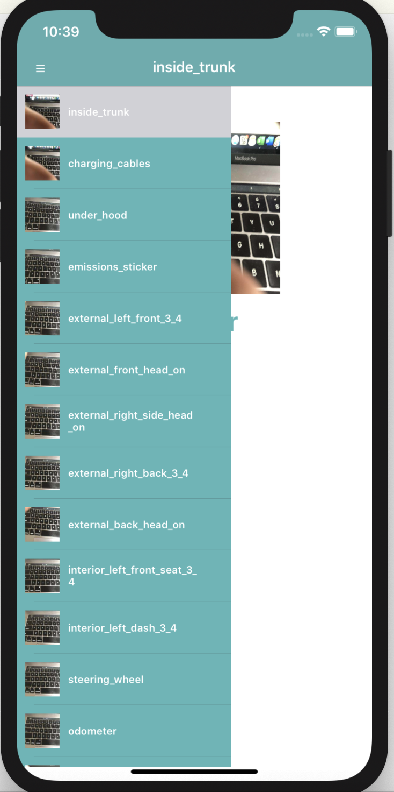
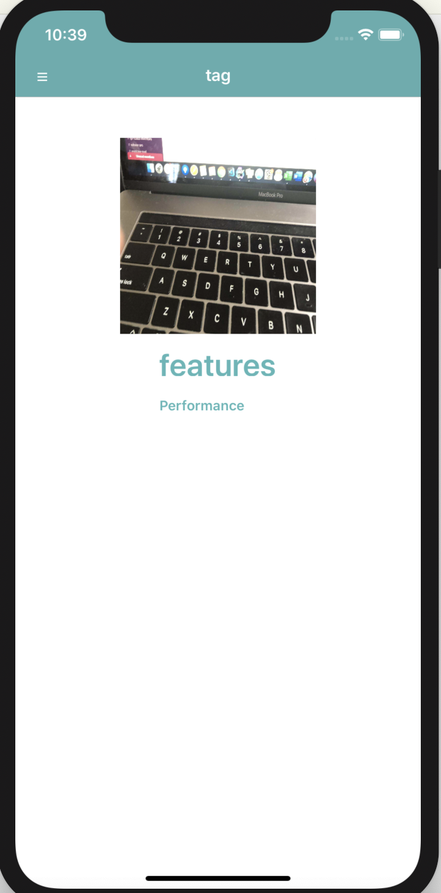

# MasterDetail

app allows user to navigate from master view to detail view.
###### app installation
  - project folder MasterDetail
  - open project file MasterDetails.xcodeproj
 

###### iOS screenshots potrait mode
  

###### iOS screenshots landscape mode
  
    

###### App architecture
- App doesn't use storyboard entire UI is made using controller class
- App is using MVC model 
- On root level DetailViewController and DetailView located
- On root Master folder where MasterTableViewController and MasterTableViewCell
- Model folder has UIDList which has data model struct of API Result
- HTTP folder has HTTPClient which is used for making API call, GenericAPIClient core api call is invoked, Endpoint URL end point is setup.

###### testing
All XCTestCase Unit testings are located in folder MasterDetailsTests
- APITesting.swift: APi response is compared with given response
- MasterTableViewControllerTest.swift: UITableView testing is performed and compare 3 cells response 
- DetailViewControllerTest.swift: Detail view contents are compared

###### Time spent
I spent 15-20 mins in sketching the UI/UX
I spent around 2 hours of time writing code
I spent around 1 hours of time in testing and covered all unit testing

###### Challenging part
Challenging part of application was to come up with UI design as I thought SplitViewController solution but that looked very naive solution
so sketched out solution that sliding menu style will be Master which will be a s layover on Detail view. In this case user doesn't need 
to go to second screen and comeback to previous screen using back button. 
